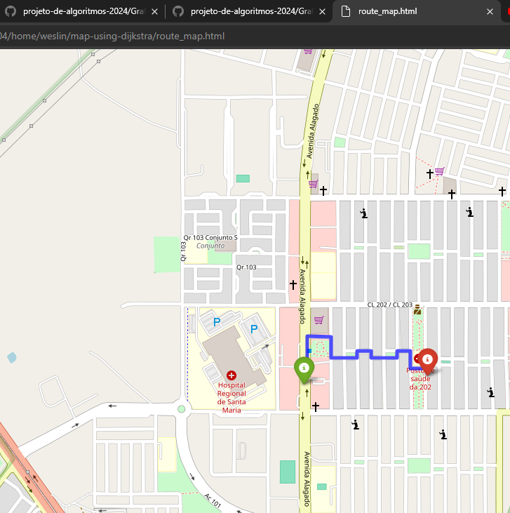

# Grafos2_menor-caminho-dijkstra

**Conteúdo da Disciplina**: Grafos 2 

## Alunos
|Matrícula | Aluno |
| -- | -- |
| 20/0044559  |  Wesley Lira Carvalho |
| 20/0061216  |  Cleber de Oliveira Brant |

## Sobre 
O objetivo do projeto consiste em mostrar como o algoritmo de Dijkstra funciona, mostrando em um mapa interativo o menor caminho de um ponto A para um ponto B.

## Screenshots

## Instalação 
**Linguagem**: Python 

Para que possa rodar o código em sua máquina, é necessário que tenha instalado o Python3 em seu computador.

Utile o comando logo abaixo para clonar o projeto para a sua máquina:

> git clone https://github.com/projeto-de-algoritmos-2024/Grafos2_menor-caminho-dijkstra.git

Dentro da pasta do projeto e com ele aberto em sua IDE de preferência, rode o comando abaixo no terminal para poder instalar as dependências do projeto:

> pip install -r requirements.txt

Antes de rodar o comando para rodar o projeto, acesse o arquivo **index.py** e na linha 42 adicione o nome do local/cidade aonde deseja saber o menor caminho. E nas linhas 45 e 46 adicione as coordenadas do ponto de partida e ponto de chegada. Essas coordenadas podem ser obtidas no **Google Maps** quando seleciona um ponto no mapa.

Após ter instalado as dependências, rode o seguinte comando no terminal dentro do diretório do projeto:

> python3 index.py

 

**OBS**: Caso não tenha o **pip** instalando em sua máquina, então rode o comando abaixo para instalá-lo em sua máquina dependendo do seu sistema operacional:

### Windows

-   Acesse a página [get-pip.py](https://bootstrap.pypa.io/get-pip.py) e baixe o arquivo.
-   Abra o prompt de comando e navegue até o diretório onde o arquivo **get-pip.py** está salvo.

>   Por exemplo, caso tenha salvado no desktop, então execute o comando: cd %HOMEPATH%\Desktop

-   Após isso, execute o script com o seguinte comando:

>   python get-pip.py

### Linux

-   Atualize a lista de pacotes
>   sudo apt update

-   Instale o pip
>   sudo apt install python3-pip

## Uso 
Após ter rodado o comando de execução do algoritmo, ele vai uma pasta **cache** onde vai estar armazenado o mapa baixado em vários arquivos **.JSON** do qual o usuário adicionou dentro do código.

No mesmo diretório onde está o arquivo **index.py** vai ter sido criado também o arquivo **mapa_com_menor_caminho.html**. Esse arquivo é o mapa interativo que foi criado após o código de execução ter sido executado no terminal.

Acesse o diretório do arquivo e abra o arquivo **mapa_com_menor_caminho.html** para poder visualizar a rota do menor caminho, entre os pontos A e B que foram selecionado, que o algoritmo de Dijkstra criou.

## Outros
- [Link apresentação](https://www.youtube.com/watch?v=fExrtBxJV8M)

